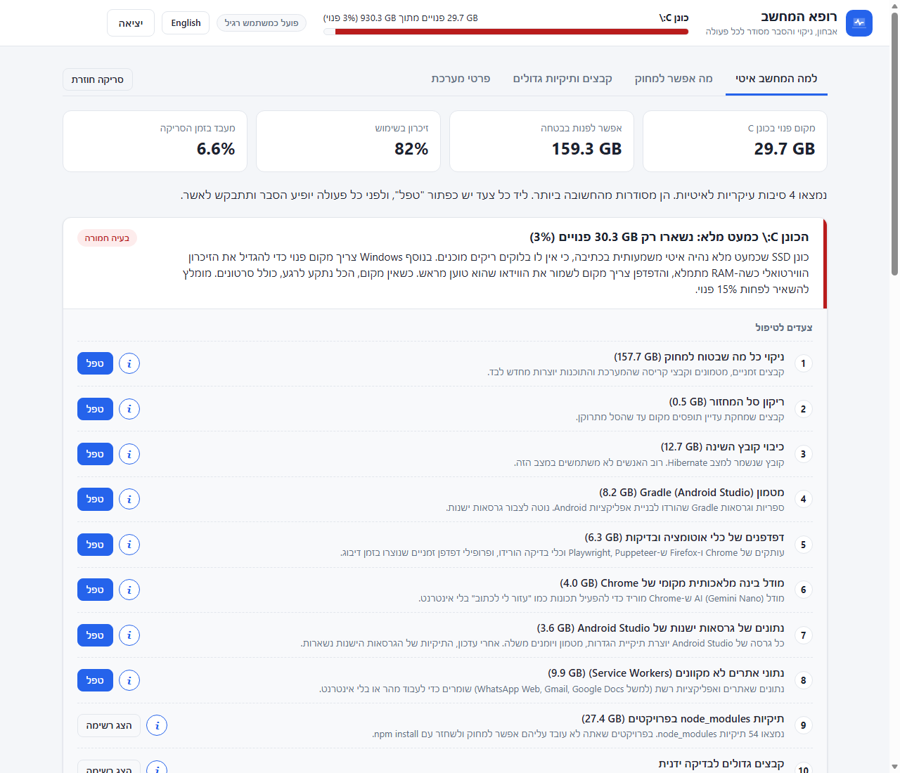
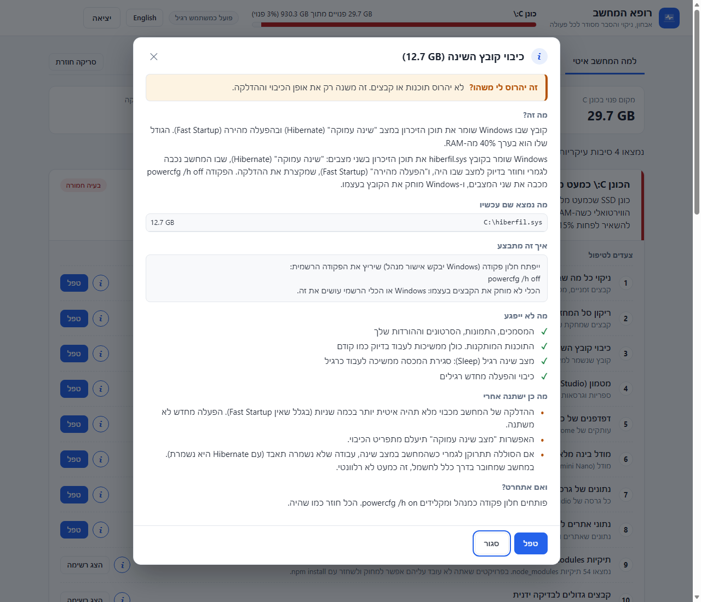

# רופא המחשב

[English](README.md) | **עברית**

תוכנה חינמית בקוד פתוח ל-Windows, שמסבירה **למה המחשב איטי** ומראה **מה אפשר למחוק בבטחה**. לפני כל פעולה מופיע הסבר ברור.

## מה התוכנה עושה

- **מוצאת למה המחשב איטי.** היא בודקת מקום בדיסק, זיכרון, תוכנות שנפתחות עם המחשב, אנטי-וירוס, הגדרות חשמל וחיבור לאינטרנט. אחר כך היא מציגה את הסיבות, מהחשובה ביותר.
- **נותנת צעדים לטיפול.** לכל צעד יש כפתור **טפל**, וכפתור **i** שמסביר בפירוט מה יקרה.
- **מראה מה אפשר למחוק.** כל תיקיית זבל ומטמון מוכרת במחשב, עם הגודל שלה ותווית בטיחות ברורה.
- **מוצאת קבצים ותיקיות גדולים.** סריקה מלאה של כונן C מראה לאן הלך המקום, אילו קבצים גדולים מ-500 MB, ואילו תיקיות `node_modules` אפשר להסיר.
- **מאפשרת לבטל.** אפשר לשמור את מה שניקית בהסגר ל-7 ימים, ולשחזר בלחיצה אחת מהלשונית **ביטול פעולות**.
- **מראה מה השגת.** אחרי הטיפול מופיע כרטיס תוצאה עם כמה ניקית, מוכן לשמירה ולשיתוף.
- **עובדת בעברית ובאנגלית.** מחליפים שפה בלחיצה אחת בסרגל העליון.

## למה זה בטוח

- **שום דבר לא קורה בלי אישור שלך.** לפני כל פעולה נפתח חלון שמסביר בדיוק מה יקרה. הפעולה מתבצעת רק אחרי שלוחצים "כן".
- **הסריקה רק קוראת.** סריקה לא מוחקת ולא משנה שום דבר.
- **אפשר לבטל.** כשהאפשרות "לשמור 7 ימים עם אפשרות ביטול" מסומנת, הקבצים מועברים הצידה במקום להימחק, והלשונית **ביטול פעולות** מחזירה אותם בדיוק למקום.
- **קבצים אישיים לא נמחקים אוטומטית אף פעם.** מסמכים, תמונות וסרטונים אפשר רק להעביר לסל המחזור, אחד אחד, בעצמך.
- **הניקוי זהיר.** קבצים שתוכנה משתמשת בהם כרגע מדולגים. גם קבצים זמניים מ-24 השעות האחרונות מדולגים.
- **שינויי מערכת עוברים דרך הכלים של Windows.** כיבוי קובץ השינה או ניקוי עדכונים ישנים מריצים את הפקודות הרשמיות של Windows, בחלון גלוי.
- **הכל נשאר במחשב שלך.** התוכנה רצה מקומית ולא מעלה שום מידע. הפעילות היחידה ברשת היא בדיקת חיבור קצרה ל-8.8.8.8 ול-1.1.1.1, כדי למדוד את מהירות האינטרנט.
- **הקוד פתוח.** כל כלל וכל הסבר נמצאים בקבצים [app/rules.py](app/rules.py) ו-[app/rules_en.py](app/rules_en.py).

## התחלה מהירה

### 1. להוריד

מורידים את **PCDoctor.exe** מ[הגרסה האחרונה](https://github.com/ozlevi29/Analyzing-files-on-the-computer/releases/latest). זה קובץ אחד. אין מה להתקין, ולא צריך Python.

### 2. להפעיל

לחיצה כפולה על **PCDoctor.exe**. נפתח חלון עם התוכנה.

ייתכן ש-Windows יציג **"Windows הגן על המחשב שלך"**. ההודעה הזו מופיעה לכל תוכנה חדשה שלא חתומה בתעודה בתשלום. לוחצים **מידע נוסף** ואז **הפעל בכל זאת**. אפשר לוודא שהקובץ הוא המקורי: טביעת האצבע שלו (SHA-256) מפורסמת לידו בעמוד הגרסה.

חלק מהניקויים, כמו קבצי עדכון ישנים של Windows, דורשים הרשאות מנהל. כשצריך, לוחצים **הפעל כמנהל** בראש החלון.

### 3. לסרוק

לוחצים **סרוק את המחשב**. סריקה מלאה לוקחת כמה דקות.

### הפעלה מקוד המקור (לא חובה)

מי שמעדיף להריץ את קוד ה-Python ישירות: מתקינים [Python 3.12 ומעלה](https://www.python.org/downloads/), מורידים את הקוד בכפתור הירוק **Code**, ולוחצים לחיצה כפולה על **`start.bat`**. כדי לבנות את ה-exe בעצמך, מריצים `python tools/build_exe.py` (צריך `pip install pyinstaller pillow`).

## איך משתמשים בתוצאות

בתוצאות יש ארבע לשוניות.

| לשונית | מה יש בה |
|---|---|
| **למה המחשב איטי** | הסיבות לאיטיות, מהחשובה ביותר, וצעדים לטיפול בכל אחת. |
| **מה אפשר למחוק** | כל תיקיית זבל ומטמון מוכרת, עם הגודל ותווית בטיחות. |
| **קבצים ותיקיות גדולים** | לאן הלך המקום, קבצים מעל 500 MB ותיקיות `node_modules`. |
| **פרטי מערכת** | זיכרון, התוכנות הכבדות, תוכנות הפעלה, תקינות הדיסק ורשת. |
| **ביטול פעולות** | כל מה שניקית עם אפשרות ביטול, עם כפתורי **שחזר** ו-**מחק עכשיו**. |

**כדאי להשאיר את אפשרות הביטול מסומנת כשאפשר.** בחלון האישור יש אפשרות **"לשמור 7 ימים עם אפשרות ביטול"**. הקבצים מועברים לתיקיית הסגר במקום להימחק, והלשונית **ביטול פעולות** מחזירה אותם. החיסרון: המקום מתפנה רק כשההסגר מתרוקן, אוטומטית אחרי 7 ימים או מיד בכפתור **מחק עכשיו**. כשהדיסק כמעט מלא, האפשרות מתחילה לא מסומנת, כדי שהמקום יתפנה מיד.

**לפני שלוחצים טפל, כדאי ללחוץ על כפתור ה-i.** הוא מראה בדיוק אילו תיקיות יימחקו ומה הגודל של כל אחת. הוא גם מפרט מה לא ייפגע, מה כן ישתנה אחרי, ואיך מחזירים.

לכל פריט יש אחת מארבע תוויות בטיחות.

| תווית | משמעות |
|---|---|
| **בטוח למחוק** | Windows או התוכנה יוצרים אותו מחדש לבד. |
| **בדוק לפני שמוחקים** | אפשר למחוק, אבל יש מחיר קטן. ההסבר אומר מה הוא. |
| **לפנות רק דרך Windows** | לא למחוק ידנית. התוכנה פותחת את הכלי הרשמי של Windows. |
| **לא למחוק** | מוצג רק כדי להסביר למה התיקייה גדולה. |

## שאלות נפוצות

**זה עובד ב-Windows 10?**
אמור לעבוד. התוכנה נבנתה ונבדקה על Windows 11, והיא משתמשת רק ביכולות של Windows שקיימות גם ב-Windows 10.

**למה זה נפתח בחלון של Edge?**
הממשק הוא דף קטן שרץ על המחשב שלך. הוא נפתח בחלון אפליקציה נפרד של Edge עם פרופיל משלו, כך שהוא לא נוגע בנתונים של הדפדפן שלך. סגירת החלון סוגרת את התוכנה.

**איך מסירים את התוכנה?**
מוחקים את PCDoctor.exe. התוכנה שומרת את ההסגר ואת הגדרות החלון בתיקייה `%LOCALAPPDATA%\PCDoctor`. קודם משחזרים או מוחקים את מה שיש בלשונית ביטול פעולות, ואז מוחקים גם את התיקייה הזו.

**למה האנטי-וירוס מזהיר עליה?**
תוכנות שנארזות לקובץ exe אחד עם PyInstaller מסומנות לפעמים בטעות. כל קוד המקור נמצא בריפו הזה, ואפשר לבנות את ה-exe בעצמך עם `python tools/build_exe.py`.

**אפשר להוסיף עוד תיקיות לניקוי?**
כן. כל מיקום הוא רשומה אחת ברשימה `RULES` בקובץ [app/rules.py](app/rules.py), והטקסט באנגלית שלו נמצא בקובץ [app/rules_en.py](app/rules_en.py).

## מבנה הקוד

| קובץ | תפקיד |
|---|---|
| `app/rules.py` | מאגר הידע: מיקומים מוכרים, רמות בטיחות והסברים בעברית. |
| `app/rules_en.py` | הטקסטים באנגלית של מאגר הידע. |
| `app/scanner.py` | מדידת גדלים, ניקוי, סל מחזור וסריקת כונן מלאה. |
| `app/diagnostics.py` | בדיקות מערכת: זיכרון, תהליכים, הפעלה, אנטי-וירוס, דיסק ורשת. |
| `app/quarantine.py` | ביטול פעולות: מעביר קבצים שנוקו הצידה ל-7 ימים, משחזר אותם או מוחק סופית. |
| `app/report.py` | בניית הדוח "למה המחשב איטי" וצעדי הטיפול, בשתי השפות. |
| `app/main.py` | השרת המקומי שמחבר בין הממשק לפעולות. |
| `app/static/` | הממשק (HTML, CSS, JavaScript). |
| `tools/build_exe.py` | בונה את `dist/PCDoctor.exe`. |
| `winget/` | קובצי ההגדרה ל-winget, מנהל ההתקנות של Windows. |

השרת המקומי מאזין רק לכתובת `127.0.0.1` ודורש מפתח אקראי שנוצר בכל הפעלה. פעולות מחיקה מתקבלות רק על נתיבים וצעדים שהסריקה עצמה הציעה.

