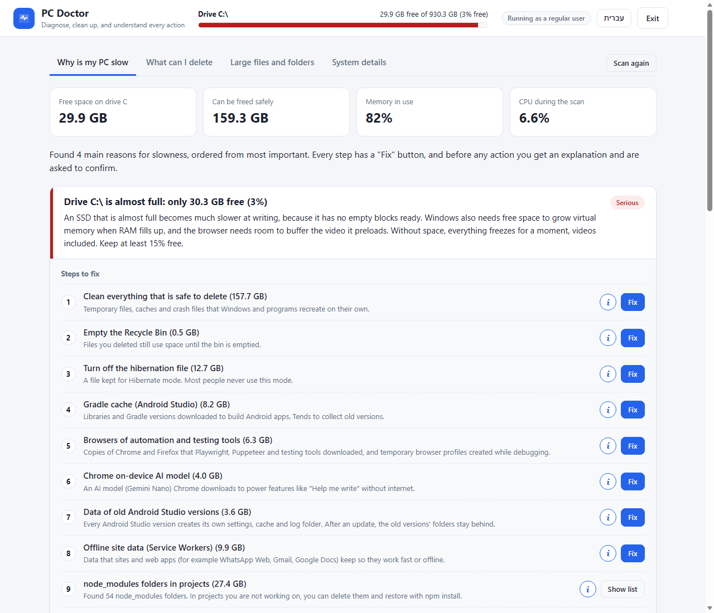
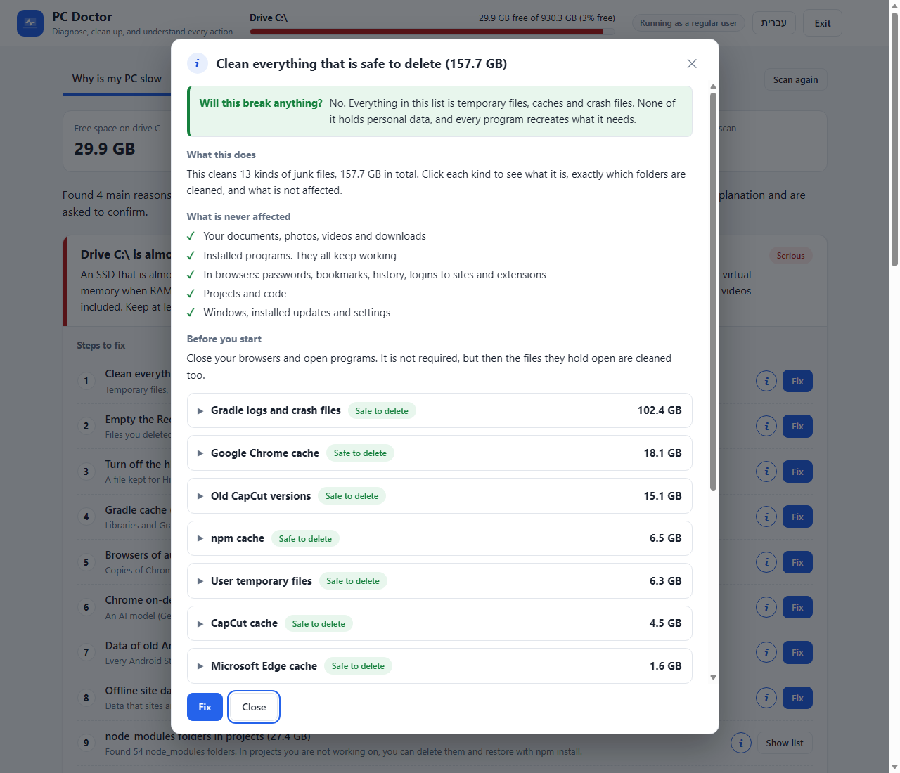
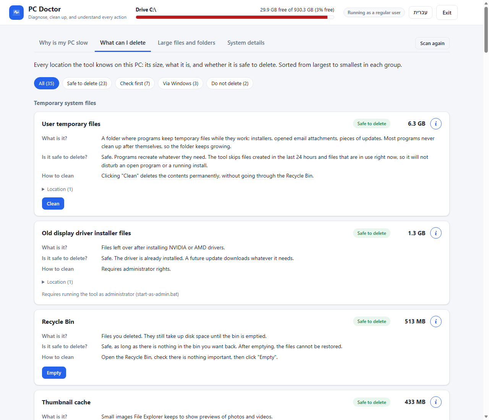

# PC Doctor

**English** | [עברית](README.he.md)

A free, open-source Windows tool that explains **why your PC is slow** and shows **what you can safely delete**, with a clear explanation before every action.



## What it does

- **Finds why the PC is slow.** It checks disk space, memory, startup programs, antivirus, power settings and your internet connection. Then it lists the causes, most important first.
- **Gives you steps to fix it.** Every step has a **Fix** button, and an **i** button that explains in detail what will happen.
- **Shows what you can delete.** It lists every known junk and cache folder on your PC, with its size and a clear safety label.
- **Finds large files and folders.** A full scan of drive C shows where the space went, which files are over 500 MB, and which `node_modules` folders you can remove.
- **Works in English and Hebrew.** Switch with one click in the top bar.

## Why it is safe

- **Nothing happens without your approval.** Before every action, a window explains exactly what will happen. It runs only after you click "Yes".
- **The scan only reads.** Scanning never deletes or changes anything.
- **Your personal files are never deleted automatically.** Documents, photos and videos can only be moved to the Recycle Bin, one at a time, by you.
- **Caches are cleaned carefully.** Files a program is using right now are skipped. Temporary files from the last 24 hours are skipped too.
- **System changes go through Windows' own tools.** Turning off hibernation or cleaning old updates runs the official Windows commands, in a visible window.
- **It stays on your computer.** The tool runs locally and uploads nothing. The only network activity is a short connection test to 8.8.8.8 and 1.1.1.1, to measure your internet speed.
- **The code is open.** Every rule and every explanation is in [app/rules.py](app/rules.py) and [app/rules_en.py](app/rules_en.py).

## Quick start

### 1. Install Python

You need **Python 3.12 or newer**. Download it from [python.org](https://www.python.org/downloads/). During installation, check **"Add python.exe to PATH"**.

No other packages are needed.

### 2. Download PC Doctor

Click the green **Code** button at the top of this page, then **Download ZIP**. Extract the ZIP to any folder.

Or, with Git:

```
git clone https://github.com/ozlevi29/Analyzing-files-on-the-computer.git
```

### 3. Run it

Double-click **`start.bat`**. A window opens with the program.

If Windows shows a security warning about the file, click **More info** and then **Run anyway**. This appears for every downloaded script.

To also clean Windows system folders, such as old update files, use **`start-as-admin.bat`** instead.

### 4. Scan

Click **Scan my PC**. The full scan takes a few minutes.

## How to use the results

The results have four tabs.

| Tab | What you will find |
|---|---|
| **Why is my PC slow** | The causes of slowness, most important first, each with steps to fix. |
| **What can I delete** | Every known junk and cache folder, with its size and a safety label. |
| **Large files and folders** | Where the space went, files over 500 MB, and `node_modules` folders. |
| **System details** | Memory, top programs, startup programs, disk health and network. |

**Before you click Fix, click the i button.** It shows exactly which folders will be deleted and how big each one is. It also lists what will not be affected, what does change afterwards, and how to undo it.



Every item has one of four safety labels.

| Label | Meaning |
|---|---|
| **Safe to delete** | Windows or the program recreates it automatically. |
| **Check before deleting** | You can delete it, but there is a small cost. The explanation says what it is. |
| **Only through Windows** | Do not delete it by hand. The tool opens the official Windows tool for it. |
| **Do not delete** | Shown only to explain why the folder is large. |



## FAQ

**Does it work on Windows 10?**
It should. It was built and tested on Windows 11, and it uses only Windows features that also exist on Windows 10.

**Why does it open in an Edge window?**
The interface is a small local web page. It opens in a separate Edge app window with its own profile, so it never touches your browser data. Closing the window closes the program.

**How do I uninstall it?**
Delete the folder. The program also keeps a small window profile in `%LOCALAPPDATA%\PCDoctor`, which you can delete too.

**Can I add more folders to clean?**
Yes. Each location is one entry in the `RULES` list in [app/rules.py](app/rules.py), with its English text in [app/rules_en.py](app/rules_en.py).

## Project structure

| File | Purpose |
|---|---|
| `app/rules.py` | The knowledge base: known locations, safety levels and Hebrew explanations. |
| `app/rules_en.py` | English texts for the knowledge base. |
| `app/scanner.py` | Measuring sizes, cleaning, Recycle Bin and the full drive scan. |
| `app/diagnostics.py` | System checks: memory, processes, startup, antivirus, disk, network. |
| `app/report.py` | Builds the "Why is my PC slow" report and its steps, in both languages. |
| `app/main.py` | The local server that connects the interface to the actions. |
| `app/static/` | The interface (HTML, CSS, JavaScript). |

The local server listens only on `127.0.0.1` and requires a random key that is created on every start. Delete actions accept only paths and steps that the scan itself produced.
